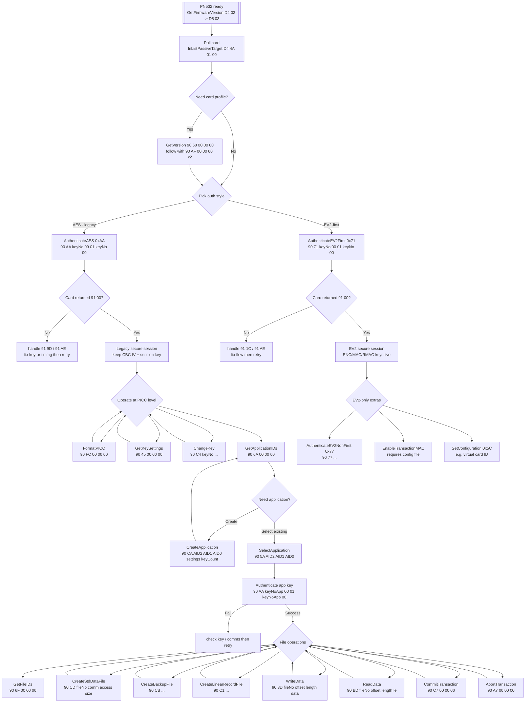
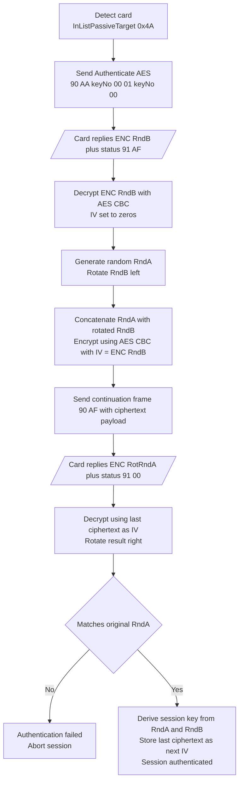

```mermaid
flowchart TD
    START[[PN532 ready<br/>GetFirmwareVersion D4 02 -> D5 03]] --> POLL[Poll card<br/>InListPassiveTarget D4 4A 01 00]
    POLL --> PROFILE{Need card profile?}
    PROFILE -->|Yes| GETVER[GetVersion 90 60 00 00 00<br/>follow with 90 AF 00 00 00 x2]
    PROFILE -->|No| AUTH_CHOICE
    GETVER --> AUTH_CHOICE

    AUTH_CHOICE{Pick auth style} -->|AES - legacy| AES_AUTH[AuthenticateAES 0xAA<br/>90 AA keyNo 00 01 keyNo 00]
    AUTH_CHOICE -->|EV2-first| EV2_AUTH[AuthenticateEV2First 0x71<br/>90 71 keyNo 00 01 keyNo 00]

    AES_AUTH --> AES_STATUS{Card returned 91 00?}
    AES_STATUS -->|No| AES_RETRY[handle 91 9D / 91 AE<br/>fix key or timing then retry]
    AES_STATUS -->|Yes| AES_SESSION[Legacy secure session<br/>keep CBC IV + session key]

    EV2_AUTH --> EV2_STATUS{Card returned 91 00?}
    EV2_STATUS -->|No| EV2_RETRY[handle 91 1C / 91 AE<br/>fix flow then retry]
    EV2_STATUS -->|Yes| EV2_SESSION[EV2 secure session<br/>ENC/MAC/RMAC keys live]

    AES_SESSION --> PICC_OPTS{Operate at PICC level}
    PICC_OPTS --> FORMAT[FormatPICC<br/>90 FC 00 00 00]
    PICC_OPTS --> GETSET[GetKeySettings<br/>90 45 00 00 00]
    PICC_OPTS --> CHANGEKEY[ChangeKey<br/>90 C4 keyNo ...]
    PICC_OPTS --> LISTAID[GetApplicationIDs<br/>90 6A 00 00 00]

    FORMAT --> PICC_OPTS
    GETSET --> PICC_OPTS
    CHANGEKEY --> PICC_OPTS

    LISTAID --> APP_BRANCH{Need application?}
    APP_BRANCH -->|Create| CREATE_APP[CreateApplication<br/>90 CA AID2 AID1 AID0 settings keyCount]
    CREATE_APP --> LISTAID
    APP_BRANCH -->|Select existing| SELECT_APP[SelectApplication<br/>90 5A AID2 AID1 AID0]

    SELECT_APP --> APP_AUTH[Authenticate app key<br/>90 AA keyNoApp 00 01 keyNoApp 00]
    APP_AUTH -->|Fail| APP_RETRY[check key / comms then retry]
    APP_AUTH -->|Success| FILE_MENU{File operations}

    FILE_MENU --> GETFILES[GetFileIDs<br/>90 6F 00 00 00]
    FILE_MENU --> CREATE_STD[CreateStdDataFile<br/>90 CD fileNo comm access size]
    FILE_MENU --> CREATE_BKP[CreateBackupFile<br/>90 CB ...]
    FILE_MENU --> CREATE_REC[CreateLinearRecordFile<br/>90 C1 ...]
    FILE_MENU --> WRITE[WriteData<br/>90 3D fileNo offset length data]
    FILE_MENU --> READ[ReadData<br/>90 BD fileNo offset length le]
    FILE_MENU --> COMMIT[CommitTransaction<br/>90 C7 00 00 00]
    FILE_MENU --> ABORT[AbortTransaction<br/>90 A7 00 00 00]

    READ --> FILE_MENU
    WRITE --> FILE_MENU
    CREATE_STD --> FILE_MENU
    CREATE_BKP --> FILE_MENU
    CREATE_REC --> FILE_MENU
    COMMIT --> FILE_MENU
    ABORT --> FILE_MENU

    EV2_SESSION --> EV2_ONLY{EV2-only extras}
    EV2_ONLY --> SWITCHSET[AuthenticateEV2NonFirst 0x77<br/>90 77 ...]
    EV2_ONLY --> TXNMAC[EnableTransactionMAC<br/>requires config file]
    EV2_ONLY --> VCID[SetConfiguration 0x5C<br/>e.g. virtual card ID]

```

```mermaid
flowchart TD
    A[Detect card<br/>InListPassiveTarget 0x4A] --> B[Send Authenticate AES<br/>90 AA keyNo 00 01 keyNo 00]
    B --> C[/Card replies ENC RndB plus status 91 AF/]
    C --> D[Decrypt ENC RndB with AES CBC<br/>IV set to zeros]
    D --> E[Generate random RndA<br/>Rotate RndB left]
    E --> F[Concatenate RndA with rotated RndB<br/>Encrypt using AES CBC with IV = ENC RndB]
    F --> G[Send continuation frame 90 AF with ciphertext payload]
    G --> H[/Card replies ENC RotRndA plus status 91 00/]
    H --> I[Decrypt using last ciphertext as IV<br/>Rotate result right]
    I --> J{Matches original RndA}
    J -->|No| K[Authentication failed<br/>Abort session]
    J -->|Yes| L[Derive session key from RndA and RndB<br/>Store last ciphertext as next IV<br/>Session authenticated]


```