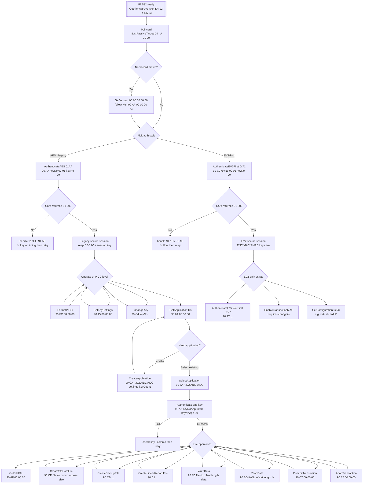
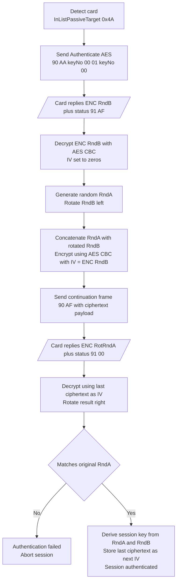

### Why AES Fails on a Factory Card

`91 AE` is the DESFire status “authentication error.” The PN532 is talking to the PICC, but the card refuses to start the AES handshake because key slot `0x00` still contains the factory 2K3DES key (24 bytes of zeros). Until you prove knowledge of that DES/3DES key and replace it with an AES key, every `AuthenticateAES (0xAA)` request on that slot will be rejected with `91 AE`.

Steps to convert a fresh card:

1. **Select the PICC application**  
   `90 5A 00 00 03 00 00 00 00`
2. **Authenticate with the default 2K3DES key**  
   Use `Authenticate (0x0A)` or `AuthenticateISO (0x1A)` against key `0x00`. The key material is 24 zero bytes from the factory.
3. **Change the key type to AES**  
   Issue `ChangeKey (0xC4)` for key `0x00`, set bit 7 of `P1` (new type = AES), provide the new 16-byte AES key XORed with the old key, and append the CRC16 required by the datasheet.
4. **Switch to AES authentication**  
   Once the key type becomes AES, `90 AA keyNo 00 01 keyNo 00` returns the encrypted `RndB` challenge so you can finish the AES handshake.

To confirm the key type before (or after) the change, call `GetKeySettings (90 45 00 00 00)`. The response’s lower nibble encodes the key type: `0x00` = 2K3DES, `0x09` = AES. When you see `0x09`, the AES authenticate path will succeed.

### Key 0 and access rights

Does key 0 of PICC have all the rights by default?

Short answer: No — key 0 is not magically "all rights" by the spec. Rights are determined by application/file access-rights and by which key the application or PICC admin was configured to use. That said, in practice many cards and workflows use key number 0 as the default master/admin key, so it often ends up controlling the most sensitive operations.

Here are the details and practical implications:

- Per-slot semantics
   - Keys are stored per scope: PICC-level (root) and per-application. Each scope has a set of numbered key slots (0..N‑1).
   - Which operations a key can perform is determined by access-rights tables and by which key index was used as the "master" when the application was created or when rights were set. The card itself enforces access by checking that the operation is authenticated with the required key index and algorithm.
   - The card does not give an implicit global privilege to "key 0" — it simply uses the index referenced by the access-control settings.

- PICC master vs application master
 - PICC master key (PICC level) controls PICC-wide operations (create/delete applications, format card, etc.). If the PICC master key slot is key 0 and you know that key, you can perform PICC-level management.
 - Each application has its own master/admin keys (one or more slots) that control file creation, ChangeKey, etc. If an application’s admin operations were set to use key 0, then key 0 for that application is effectively the application admin.

- Factory defaults and common practice
 - Many cards ship with default keys (often all-zero keys) and default settings that make key 0 the effective administrative key for some operations. That is a convenience for provisioning, but not a security feature.
 - Because of that history, key 0 is commonly the first thing attackers try — so don’t rely on it being “safe”.

- Mixing algorithms (AES vs DES/3DES)
   - Algorithm and key type are a per-slot attribute (after ChangeKey you set both key bytes and the key-type/version). You can mix algorithms across slots.
   - If any remaining weak slot (DES/3DES) grants the ability to perform critical operations (e.g., ChangeKey, write sensitive files, escalate), your card remains vulnerable even if other slots use AES.

- How to determine whether key 0 has admin rights on your card
   1. Check PICC-level settings to see which slot is PICC admin (PICC master). If PICC master = slot 0 then key 0 controls PICC-level operations.
   2. For each application:
      - Inspect the application key settings and file access-rights (which key index is required for read/write/change for each file).
      - Call GetKeyVersion for each key slot to see their stored version/tag (and identify algorithm by your convention).
   3. If an access right references key 0, then key 0 controls that operation for that application/file.

- Practical migration/security advice
   -  Audit first: list keys and file access-rights for each app. Identify which key numbers gate critical operations.
   - Prioritize migrating those key slots to AES (ChangeKey while authenticated with existing key).
   - For keys you no longer want to be usable: remove them from access rights, set them to random values, or reassign access to AES-only keys.
    -Record and use a consistent keyVersion encoding so your host can automatically pick the right auth method (AES vs DES).
