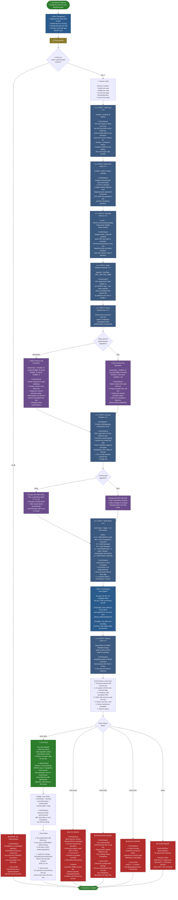

```mermaid
flowchart TD
    Start([🔑 ChangeKey Request:<br/>Change key slot N to new algorithm/value]) --> Why1[📖 WHY ChangeKey?<br/>• Upgrade from weak DES to AES<br/>• Rotate keys for security<br/>• Change key type per-slot<br/>• Provision card with app-specific keys]
    
    Why1 --> PreReq[📋 Prerequisites]
    
    PreReq --> CheckAuth{Is there an<br/>active authenticated<br/>session?}
    
    CheckAuth -->|No ❌| AuthError[❌ ERROR: Not Authenticated<br/><br/>💡 RATIONALE:<br/>ChangeKey is a privileged operation.<br/>Card enforces that you must prove<br/>you know the CURRENT key before<br/>you can change it to a NEW key.<br/><br/>🔧 SOLUTION:<br/>Call authenticate or authenticateAES<br/>with the current key first.]
    
    CheckAuth -->|Yes ✓| HaveSession[✓ Session Valid<br/><br/>Session contains:<br/>• RndA from auth<br/>• RndB from auth<br/>• Current key type DES/3DES/AES<br/>• Current key value]
    
    HaveSession --> Step1[═══ STEP 1: XOR Keys ═══<br/><br/>xorData = newKey ⊕ oldKey<br/><br/>💡 RATIONALE:<br/>The card needs to verify you know<br/>the OLD key AND set the NEW key.<br/>XOR encodes both in one operation:<br/>Card can recover newKey by:<br/>newKey = xorData ⊕ oldKey<br/>If attacker doesn't know oldKey,<br/>they can't forge valid xorData.]
    
    Step1 --> Step2[═══ STEP 2: Build CRC Data ═══<br/><br/>crcData = #91;0xC4, keyNo, xorData#93;<br/><br/>💡 RATIONALE:<br/>Include command byte 0xC4 and keyNo<br/>in CRC to prevent:<br/>• Replay attacks different cmd<br/>• Applying same payload to wrong slot<br/>CRC binds the payload to this<br/>specific ChangeKey operation.]
    
    Step2 --> Step3[═══ STEP 3: Calculate CRC16 ═══<br/><br/>crc16 = CRC16_ISO14443A#40;crcData#41;<br/>Polynomial: 0x8005<br/>Initial: 0x6363<br/><br/>💡 RATIONALE:<br/>Integrity check. Card will compute<br/>same CRC and reject if mismatch.<br/>Prevents transmission errors and<br/>tampering with encrypted payload.<br/>Uses ISO 14443-3 Type A standard.]
    
    Step3 --> Step4[═══ STEP 4: Build Plaintext Payload ═══<br/><br/>payload = #91;xorData, CRC_LSB, CRC_MSB#93;<br/><br/>💡 RATIONALE:<br/>CRC appended in little-endian as<br/>per DESFire spec. This entire payload<br/>will be encrypted with session key<br/>so attacker can't see or modify it.]
    
    Step4 --> Step5[═══ STEP 5: Derive Session Key ═══<br/><br/>Session key is derived from the<br/>random challenges exchanged during<br/>authentication mutual auth]
    
    Step5 --> AlgoCheck{What was the<br/>authentication<br/>algorithm?}
    
    AlgoCheck -->|3DES/DES| SessionDES[🔐 3DES Session Key Derivation<br/><br/>sessionKey = RndA#91;0..3#93; concat RndB#91;0..3#93; concat<br/>RndA#91;4..7#93; concat RndB#91;4..7#93;<br/><br/>💡 RATIONALE:<br/>• Takes 4 bytes from each challenge<br/>• Creates 16-byte 2-key 3DES key<br/>• Unique per session prevents replay<br/>• Both parties can derive it<br/>• Never transmitted over wire<br/>• Changes every authentication]
    
    AlgoCheck -->|AES| SessionAES[🔐 AES Session Key Derivation<br/><br/>sessionKey = RndA#91;0..3#93; concat RndB#91;0..3#93; concat<br/>RndA#91;12..15#93; concat RndB#91;12..15#93;<br/><br/>💡 RATIONALE:<br/>• Takes 4 bytes from start and end<br/>• Creates 16-byte AES-128 key<br/>• Unique per session prevents replay<br/>• Uses non-contiguous bytes for<br/>better entropy distribution]
    
    SessionDES --> Step6
    SessionAES --> Step6
    
    Step6[═══ STEP 6: Encrypt Payload ═══<br/><br/>encPayload = Encrypt_CBC#40;payload,<br/>sessionKey, IV=0#41;<br/><br/>💡 RATIONALE:<br/>CBC mode with IV=0 per DESFire spec:<br/>• Prevents eavesdropping<br/>• Session key unique per auth<br/>• Even if attacker captures encrypted<br/>ChangeKey, can't replay or decrypt<br/>• IV=0 is safe because session key<br/>is single-use]
    
    Step6 --> AlgoCheck2{Current auth<br/>algorithm?}
    
    AlgoCheck2 -->|3DES| Encrypt3DES[Encrypt with 3DES-CBC:<br/>• Key: sessionKey bytes 0..7, 8..15<br/>• Encrypt in 8-byte blocks<br/>• CBC chains blocks automatically<br/>• Pad last block with zeros if needed]
    
    AlgoCheck2 -->|AES| EncryptAES[Encrypt with AES-128-CBC:<br/>• Key: sessionKey 16 bytes<br/>• Pad to multiple of 16 bytes<br/>• Standard AES-128 CBC mode]
    
    Encrypt3DES --> Step7
    EncryptAES --> Step7
    
    Step7[═══ STEP 7: Build APDU ═══<br/><br/>keyVersion = #40;algo << 4#41; OR revision<br/><br/>APDU:<br/>CLA = 0x90 DESFire class<br/>INS = 0xC4 ChangeKey command<br/>P1 = 0x00 Standard<br/>P2 = 0x00 Standard<br/>Lc = encPayload.size + 2<br/>Data = #91;keyNo, encPayload, keyVersion#93;<br/>Le = 0x00 Expect response<br/><br/>💡 RATIONALE:<br/>• keyVersion is NOT encrypted<br/>• Card stores it for GetKeyVersion<br/>• Host can query later to know algo<br/>• Lc includes keyNo + encPayload + version]
    
    Step7 --> Why2[💡 WHY is keyVersion unencrypted?<br/><br/>Security: No risk. It's metadata about<br/>the key TYPE not the key VALUE.<br/><br/>Practicality: Host needs to know which<br/>auth algorithm to use next time<br/>without authenticating first.<br/><br/>Flexibility: You define the encoding.<br/>Common: high nibble=algo, low=revision]
    
    Why2 --> Step8[═══ STEP 8: Send to Card ═══<br/><br/>Wrap APDU in PN532 InDataExchange<br/>Send to card via NFC<br/>Wait for response<br/><br/>💡 RATIONALE:<br/>InDataExchange is PN532 command<br/>that forwards ISO 7816-4 APDU<br/>to the card and returns response]
    
    Step8 --> Response[Card receives, processes:<br/>1. Decrypts payload with session key<br/>2. Computes CRC16 over received data<br/>3. Compares with decrypted CRC<br/>4. XORs with old key to get new key<br/>5. Stores new key in slot<br/>6. Stores keyVersion metadata<br/>7. Returns status]
    
    Response --> ParseStatus{Parse Status<br/>Bytes}
    
    ParseStatus -->|0x91 0x00| Success[✅ SUCCESS<br/><br/>Key slot updated!<br/>• New key stored<br/>• New algorithm active<br/>• keyVersion saved<br/>• Old key no longer valid for this slot<br/><br/>⚠️ IMPORTANT:<br/>Session is now INVALID.<br/>DESFire spec: ChangeKey ends session.<br/>Next operation must re-authenticate<br/>using NEW key with appropriate<br/>algorithm: INS=0x0A or INS=0xAA]
    
    ParseStatus -->|0x91 0xAE| AuthErr[❌ AUTH ERROR<br/><br/>💡 RATIONALE:<br/>Most common causes:<br/>• Wrong CRC16 calculation<br/>• Incorrect session key derivation<br/>• Wrong encryption mode CBC vs ECB<br/>• IV not set to 0<br/>• Payload not padded correctly<br/>• XOR with wrong old key<br/><br/>🔧 DEBUG:<br/>Log RndA, RndB, session key,<br/>plaintext payload, encrypted payload.<br/>Compare with known test vectors.]
    
    ParseStatus -->|0x91 0x9D| PermErr[❌ PERMISSION DENIED<br/><br/>💡 RATIONALE:<br/>• Not authenticated<br/>• Authenticated with wrong key<br/>• Target keyNo requires different auth<br/>• Key settings forbid ChangeKey<br/><br/>🔧 SOLUTION:<br/>Check key configuration settings.<br/>Ensure authenticated with key that<br/>has ChangeKey permission for target slot.]
    
    ParseStatus -->|0x91 0x7E| LengthErr[❌ LENGTH ERROR<br/><br/>💡 RATIONALE:<br/>• Lc byte incorrect<br/>• Payload size doesn't match<br/>expected for new key type<br/>• Missing or extra bytes<br/><br/>🔧 SOLUTION:<br/>Verify Lc = 1 keyNo +<br/>encrypted payload size +<br/>1 keyVersion]
    
    ParseStatus -->|Other| OtherErr[❌ OTHER ERROR<br/><br/>Check DESFire documentation<br/>for status byte meaning.<br/><br/>Common codes:<br/>0x91 0x1C = Crypto error<br/>0x91 0xCA = Command aborted<br/>0x91 0xF0 = File not found]
    
    Success --> UpdateLocal[Update Local State:<br/>• currentKey = newKey<br/>• currentKeyType = newKeyType<br/>• sessionValid = false<br/><br/>💡 RATIONALE:<br/>Keep local state synchronized<br/>with card state so next ChangeKey<br/>can XOR correctly.]
    
    UpdateLocal --> NextSteps[🎯 Next Steps:<br/><br/>1. Re-authenticate with NEW key:<br/>If new type is DES/3DES: authenticate#40;#41;<br/>If new type is AES: authenticateAES#40;#41;<br/><br/>2. Verify the change:<br/>Call getKeyVersion#40;keyNo#41;<br/>Check returned byte matches<br/>what you set<br/><br/>3. Test access:<br/>Try operations protected by this key<br/>Ensure they work with new key]
    
    NextSteps --> End([🏁 ChangeKey Complete])
    
    AuthError --> End
    AuthErr --> End
    PermErr --> End
    LengthErr --> End
    OtherErr --> End
    
    style Start fill:#2d7d2d,stroke:#1a4d1a,color:#fff
    style End fill:#2d7d2d,stroke:#1a4d1a,color:#fff
    style Success fill:#2d7d2d,stroke:#1a4d1a,color:#fff
    style AuthError fill:#b32d2d,stroke:#801f1f,color:#fff
    style AuthErr fill:#b32d2d,stroke:#801f1f,color:#fff
    style PermErr fill:#b32d2d,stroke:#801f1f,color:#fff
    style LengthErr fill:#b32d2d,stroke:#801f1f,color:#fff
    style OtherErr fill:#b32d2d,stroke:#801f1f,color:#fff
    style Why1 fill:#2b5b8c,stroke:#1a3a5c,color:#fff
    style Why2 fill:#2b5b8c,stroke:#1a3a5c,color:#fff
    style PreReq fill:#8c7b2b,stroke:#5c4d1a,color:#fff
    style Step1 fill:#3d5a80,stroke:#2d4060,color:#fff
    style Step2 fill:#3d5a80,stroke:#2d4060,color:#fff
    style Step3 fill:#3d5a80,stroke:#2d4060,color:#fff
    style Step4 fill:#3d5a80,stroke:#2d4060,color:#fff
    style Step5 fill:#3d5a80,stroke:#2d4060,color:#fff
    style Step6 fill:#3d5a80,stroke:#2d4060,color:#fff
    style Step7 fill:#3d5a80,stroke:#2d4060,color:#fff
    style Step8 fill:#3d5a80,stroke:#2d4060,color:#fff
    style SessionDES fill:#6b4d8c,stroke:#4d3360,color:#fff
    style SessionAES fill:#6b4d8c,stroke:#4d3360,color:#fff
    style Encrypt3DES fill:#6b4d8c,stroke:#4d3360,color:#fff
    style EncryptAES fill:#6b4d8c,stroke:#4d3360,color:#fff
```