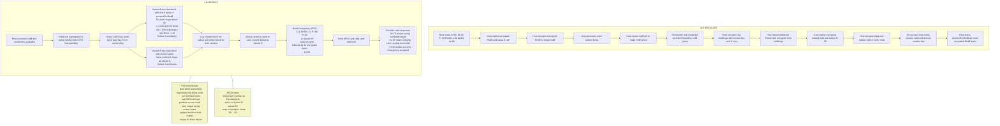

```mermaid
flowchart TB
  %% Authenticate flow
  subgraph AUTHENTICATE
    A1[Host sends APDU 90 0A P1 00 P2 00 Lc 01 keyNo Le 00]
    A2[Card replies encrypted RndB and status 91 AF]
    A3[Host decrypts encrypted RndB to obtain rndB]
    A4[Host generates rndA random bytes]
    A5[Host rotates rndB left to make rndB prime]
    A6[Host builds host challenge as rndA followed by rndB prime]
    A7[Host encrypts host challenge with session key and IV zero]
    A8[Host sends Additional Frame with encrypted host challenge]
    A9[Card replies encrypted rotated rndA and status 91 00]
    A10[Host decrypts reply and rotates right to verify rndA]
    A11[On success host marks session valid and derives session key]
    A12[Host stores sessionEncRndB as exact encrypted RndB bytes]

    A1 --> A2 --> A3 --> A4 --> A5 --> A6 --> A7 --> A8 --> A9 --> A10 --> A11 --> A12
  end

  %% ChangeKey flow
  subgraph CHANGEKEY
    C0[Prereq session valid and sessionKey available]
    C1[Build raw cryptogram 24 bytes newKey then CRC then padding]
    C2[Derive 3DES key lanes key1 key2 key3 from sessionKey]
    C3A[Variant A seed last block with first 8 bytes of sessionEncRndB
        For each 8 byte block do
        x = plain xor last block
        out = DES3 decrypt x
        last block = out
        Collect 3 out blocks]
    C3B[Variant B seed last block with all zero value
        Same per block steps as Variant A
        Collect 3 out blocks]
    C4[Log IV plain block xor values and cipher block for both variants]
    C5[Select variant to send to card, current default is Variant B]
    C6[Build ChangeKey APDU
        CLA 90 INS C4 P1 00 P2 00
        Lc equals 25
        Data is keyNo followed by 24 encrypted bytes
        Le 00]
    C7[Send APDU and read card response]
    C8[Possible card responses
        91 7E means wrong command length
        91 1E means integrity error cryptogram invalid
        91 00 means success change key accepted]

    C0 --> C1 --> C2 --> C3A
    C2 --> C3B
    C3A --> C4
    C3B --> C4
    C4 --> C5 --> C6 --> C7 --> C8
  end

  %% Notes
  Notes1[Per block details
    plain block assembled big endian into 64 bit word
    xor with last block
    use DES3 decrypt primitive on xor result
    write output as big endian bytes
    update last block with output
    repeat for three blocks]
  Notes2[APDU notes
    include key number as first data byte
    set Lc to 1 plus 24 equals 25
    wrap in transport frame 90 ... 00]

  CHANGEKEY --- Notes1
  CHANGEKEY --- Notes2

  classDef note fill:#f3f4c8,stroke:#666,stroke-width:1px;
  class Notes1,Notes2 note;
```